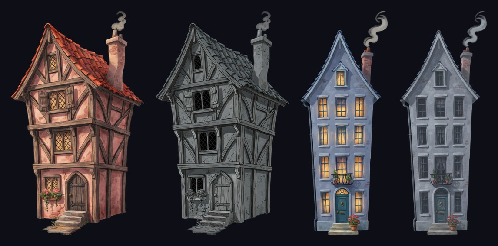
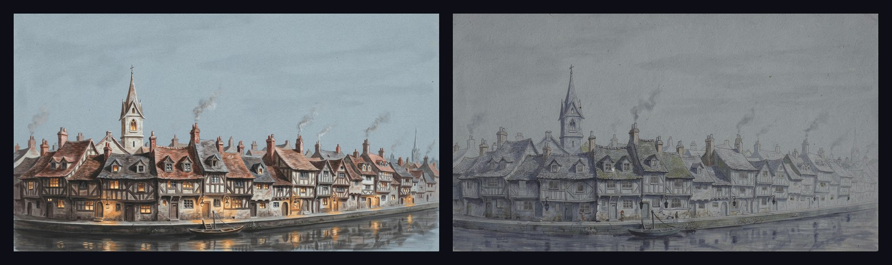
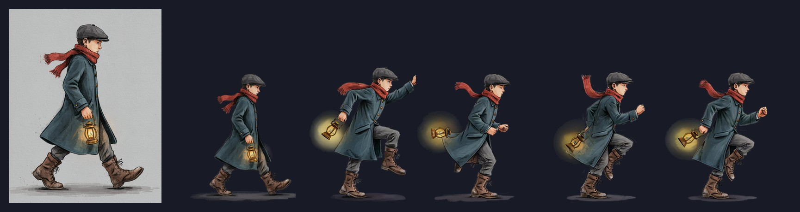
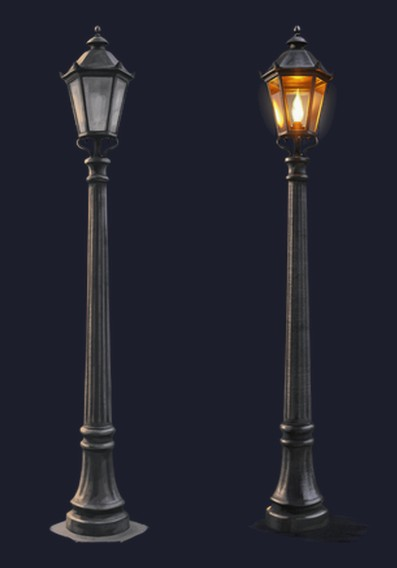

# The Last Lamplighter

**A gloom has drained the colour from a canal town. You are its last lamplighter.**

Carry your lantern through the dark streets, over rooftops and rope bridges, and light every
street lamp before your own flame gutters out. Wherever your light falls, the town remembers
its colour. Shadow wisps hunt the glow of your lantern, but steady lamplight unmakes them.
Light all six lamps and ring the bell tower to wake the town.

## How to play

- **A D** or **arrow keys**: walk
- **Space** / **W** / **Up**: jump (hold for higher)
- **X**: flare. Spend some of your flame to burn away nearby wisps
- **Esc**: pause, **R**: back to the last lamp, **M**: sound

Your lantern is your light and your life. It slowly burns down in the dark; stand near a lit
lamp to refill it, and grab floating embers on the way. Takes about 5 minutes. Plays in the
browser (desktop recommended); the button in the corner goes fullscreen.

## How DreamLayer made this game

**The core mechanic is a DreamLayer edit.** Every scene in the town was painted twice:

1. I generated each scene in its warm, **lit** state with DreamLayer.
2. I passed that image back to DreamLayer as the reference with one instruction:
   *"Keep this exact scene and composition, every shape in the same place, same framing. Drain
   all warmth and colour: cold desaturated blue-grey, dim and foggy, every window and lamp dark."*
   That gave a matching **gloom** painting. The gloom version takes the lit painting's cutout as
   its mask, so the two always share one silhouette.
3. In Unity, a second camera renders the lit town into a texture and a third paints every light
   into a light map. A full-screen pass blends lit over gloom wherever there is light, so the town
   literally regains DreamLayer's lit version wherever your lantern reaches.

**One character, every pose.** The lamplighter was generated once as a reference. That image went
into DreamLayer's sprite-sheet tool, and the idle, run and jump in the game are cut from the sheet
it returned, so the character is the same painting in every pose.

**A Unity importer for DreamLayer sprite sheets.** DreamLayer exports each animation as a ZIP
(`sheet.png` + `atlas.json`). I wrote an editor importer that turns those ZIPs straight into
sliced sprites, AnimationClips and an Animator, and fixes the things that break in a real game:
the pivot is put on the character's feet (measured from the pixels), the character is the same
height in every clip even though each sprite job comes back at its own scale, the intro frames
where the reference pose eases into the action are skipped, and the clip is retimed from
DreamLayer's video sampling (500 ms per frame) to game speed.

Everything else you see was made the same way: the houses, the street, the rope bridges, the
street lamps (an unlit lamp, then "same lamp, now lit"), the embers, the shadow wisps and the
title painting. Background removal turned each prop into a game-ready transparent sprite.

**What was not made with DreamLayer:** code, level design and sound. Every sound is synthesized
in code (oscillators, filter sweeps, a music box) and rendered to audio files by a script, and
the melody grows warmer and fuller with every lamp you light.

## Credits

Design, code and art direction: Nabeel Hassan
Art: generated with DreamLayer
Engine: Unity 2021.3 LTS (WebGL)
Fonts: Cinzel and Cormorant Garamond (SIL Open Font License)

Made for the DreamLayer Jam, October 2026.
